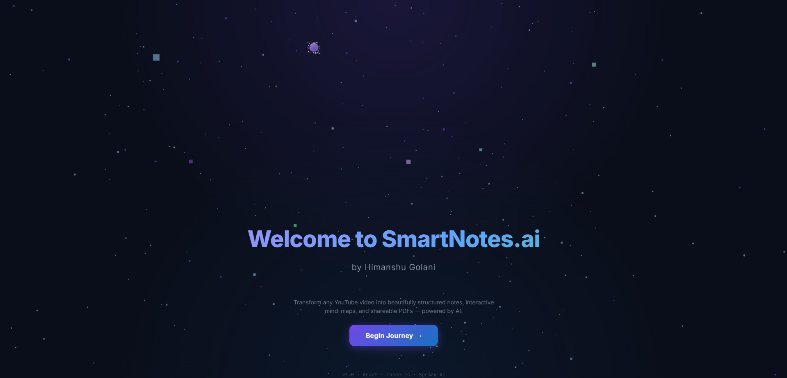
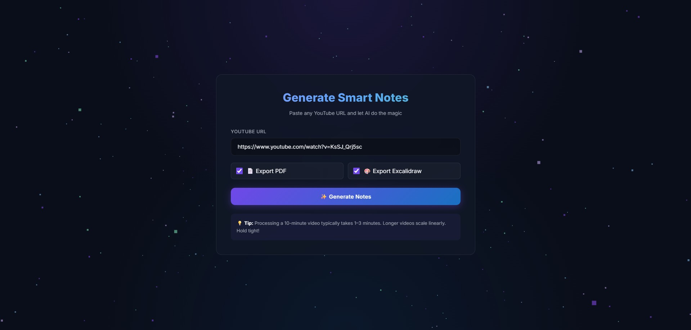
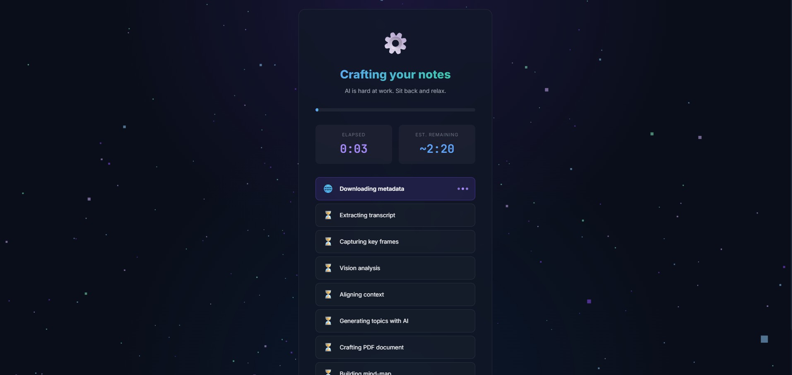
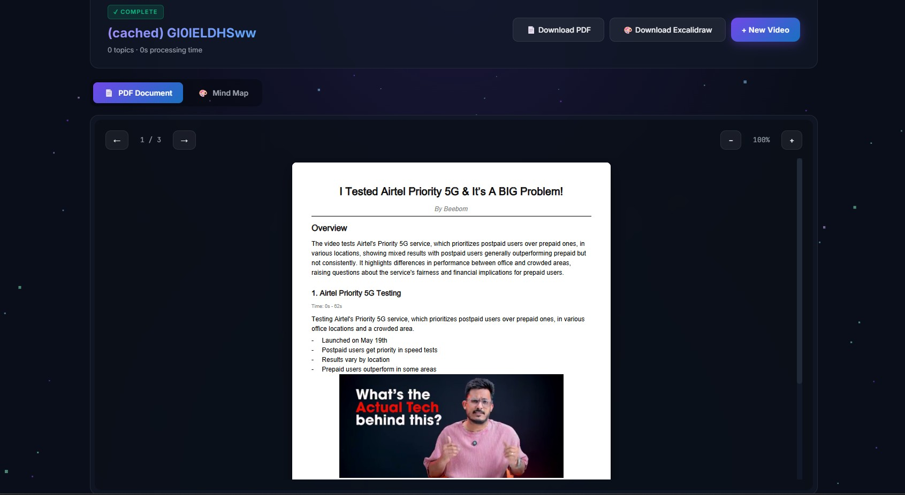
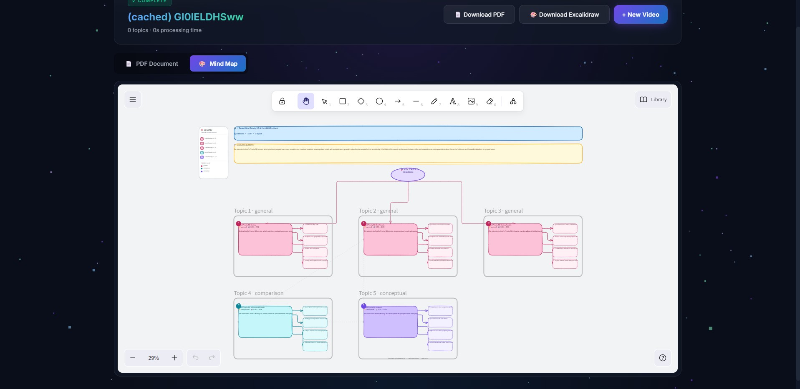

# SmartNotes.AI

SmartNotes.AI is a prototype web app that generates structured notes and a mind-map from a YouTube video. It extracts frames, transcribes audio, summarizes key topics, builds a PDF of notes, and renders an Excalidraw mind map.

## Features

- Convert a YouTube video into searchable, summarized notes (PDF).
- Generate an Excalidraw mind map of identified topics.
- Visual UI flow: Home → URL input → Processing → PDF notes → Mind map.

## Demo (UI Flow)

1. Home page



2. Enter YouTube URL (input page)



3. Processing / loading video (frames extraction, transcription, AI processing)



4. PDF notes generated (download or preview)



5. Excalidraw mind map view



## How it works (high level)

1. Paste a YouTube URL on the input page and submit.
2. Backend downloads the video, extracts frames at configured intervals, and sends audio for transcription.
3. AI services summarize transcript segments and generate topic sections and an Excalidraw MCP payload.
4. The app assembles a PDF with notes and shows an interactive Excalidraw mind map.

## Prerequisites

- Java 21 (the backend is built for Java 21).
- Maven (or use the included wrapper `mvnw` / `mvnw.cmd`).
- Node.js (v16+ recommended) and npm/yarn for the frontend.
- `yt-dlp` and `ffmpeg` available on PATH for video download and processing.
- Optional AI services referenced in `application.yaml`:
  - Ollama AI server (default: `http://localhost:11434`)
  - Whisper transcription server (default: `http://localhost:8001`)

These defaults are visible in `smartnotes-ai/src/main/resources/application.yaml` and can be changed there.

## Running locally

1. Start the backend (from the `smartnotes-ai` folder):

```bash
cd smartnotes-ai
# Linux / macOS
./mvnw spring-boot:run
# Windows (PowerShell)
.\mvnw.cmd spring-boot:run
```

The backend listens on port `8080` by default.

2. Start the frontend (from the `fontend/smartnotes-frontend` folder):

```bash
cd fontend/smartnotes-frontend
npm install
npm run dev
```

Open the frontend in your browser (Vite typically serves at `http://localhost:5173`).

## Usage

1. Open the app in your browser.
2. On the Home page, click through to the URL input page.
3. Paste a YouTube URL and submit; the app will show a processing page while it downloads and analyzes the video.
4. When complete, view or download the generated PDF notes and open the Excalidraw mind map.

## Configuration notes

- Edit `smartnotes-ai/src/main/resources/application.yaml` to adjust model endpoints, frame extraction interval, and service URLs.
- Make sure `yt-dlp` and `ffmpeg` binaries configured there are installed and accessible.

## Troubleshooting

- If the backend fails to start, ensure Java 21 is installed and that ports `8080` / `11434` / `8001` are free or correctly configured.
- If transcription or AI features fail, confirm external services (Whisper / Ollama) are running and reachable.
- Check logs for `com.smartnotes` (logging is set to DEBUG in `application.yaml`).

## Notes and next steps

- This repository contains a demo UI under `fontend/smartnotes-frontend` and a Spring Boot backend under `smartnotes-ai`.
- The `demo/` folder contains the screenshots used above.

If you'd like, I can also:

- Add image captions or alt text improvements.
- Update the README with exact command examples for Windows/macOS or add troubleshooting commands.
- Create a small CONTRIBUTING.md or run scripts to automate setup.
